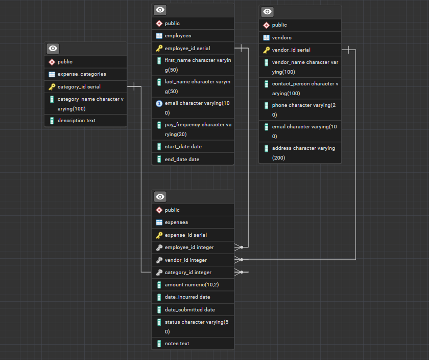

# Overview
This application is meant to serve as a tool for small businesses to track employees, expenses, clients, invoices, receipts, and pay. This specific portion of the application covers the construction of the database and the backend API that will interact with the database. By the completion of this application, it will be a full-stack application that will be deployed on the cloud for personal use. 

Below you will find a demonstration of the database, with 4 tables, as well as the API interacting with the Database via Postman.

[Software Demo Video](https://youtu.be/Hyo2Tvu44Rw)

# Relational Database

This database is a PostgreSQL database that contains 4 tables. Below is an ERD of the database which is in 3NF. 

The 4 tables are Employees, Vendors, Expenses, and Expense Categories. To meet 3NF each table's non-key attribuites depend solely on the table's Primary Key, and each relationship between the tables is defined via Foreign Keys. The best example of this is the Expenses table, as each attribute that's not a Foreign Key depends on the `expense_id`. 

The database table creation script and the data seeding scripts can be found in the following path `/Server/database` there you will find 2 `.sql` files that contain both scripts.

# Development Environment

This application was developed using Visual Studio Code, pgAdmin (PostgreSQL GUI), and Docker Desktop

The Database was built and seeded using PostgreSQL. The backend API was built in Node.js using Express.js 

For a list of dependencies installed in the Backend API, please reference the `package.json` file located in the `Server` directory.

The database for this application is run in a Docker container with a PostgreSQL image. Everything needed to setup the database in Docker is in the `docker-compose.yml` file in the `root` directory. 

Please note that database usernames and passwords exist in a `.env` file within the `root` directory, and you will need to create those within a local version of a `.env` file to spin up a Docker container with the instance of the Database. Once you've added all the required information to your `.env` file (`DB_USERNAME`, `DB_PASSWORD`), you will run `docker-compose up -d` in the termnial and an instance of the Database will be spun up. 

To ensure there's data in the database connect pgAdmin to the Docker instance and run the table creation script and the data seeding scripts within the `database` directory, and you will have data to work with in the Database. 

# Useful Websites

- [PostgreSQL Documentation](https://www.postgresql.org/docs/current/index.html)
- [Node.js Documentation](https://nodejs.org/docs/latest/api/)
- [Express.js Documentation](https://expressjs.com/)
- GitHub Copilot Chat (Free Version) - Built into Visual Studio (Helped with troubleshooting bugs and peer reviewing code)

# Future Work

- Add tables to the database to cover clients, invoices, receipts, and payroll
- Update the Backend API to be in C#
- Create a Frontend in React.js